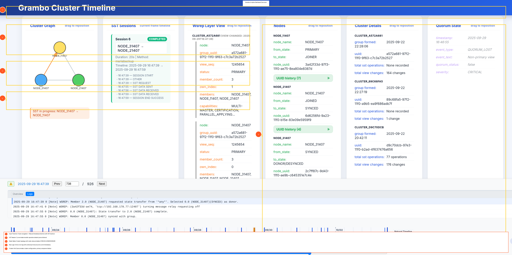

# Grambo v3-alpha Dashboard Overview



## Key Features

### 1️⃣ Dual Timeline Navigation
**Frame-by-frame + Natural timestamp-based timeline**

- **Frame Navigation Bar**: Slider to navigate through analysis frames sequentially
- **Natural Timeline Track**: Displays events positioned by actual timestamps
  - **Orange SST markers**: Show SST operations at their start times
  - **Red/Yellow/Purple markers**: Cluster, node, and component issues
  - Click markers to jump directly to corresponding frame

### 2️⃣ Current SST Session Details
**Real-time state transfer operation tracking**

Displays active SST (State Snapshot Transfer) operations:
- **Joiner Node**: Node receiving the data (← arrow direction)
- **Donor Node**: Node providing the data
- **Transfer Method**: mariabackup, rsync, xtrabackup, etc.
- **Status**: COMPLETED, IN_PROGRESS, FAILED
- **Timestamps**: Start time, end time, duration
- **Session Events**: Detailed timeline of SST phases

### 3️⃣ Node States & Cluster Views
**Live cluster topology visualization**

- **Node States**: Real-time status of each node
  - `SYNCED`: Node synchronized with cluster
  - `JOINER`: Node receiving SST
  - `DONOR/DESYNCED`: Node providing SST
  - `PRIMARY`: Node in primary component
- **Cluster Views**: View membership changes over time
- **Node Properties**: UUIDs, addresses, versions
- **State Transitions**: Track how nodes change states

### 4️⃣ Inline Raw Error Log
**Contextual log lines with intelligent centering**

- **Timestamp-based context**: Shows ~10 lines before, ~110 lines after target timestamp
- **Highlighted target line**: Blue background indicates the frame's timestamp
- **Direct log access**: See actual error messages and events
- **Smart scrolling**: Auto-scrolls to target line for immediate context
- **Large context window**: ~121 total lines for comprehensive visibility

### 5️⃣ Cluster & Quorum State
**Cluster health and configuration**

- **Quorum Status**: Whether cluster has quorum
- **Primary Component**: Indicator of primary vs non-primary state
- **Cluster Configuration**: Number of nodes, cluster UUID
- **View Changes**: Track when nodes join/leave cluster
- **Configuration Updates**: See parameter changes

## Dashboard Layout

```
┌─────────────────────────────────────────────────────────────┐
│  [Timeline] Frame Nav + Natural Timeline with SST Markers   │
├──────────────────────────────┬──────────────────────────────┤
│                              │                              │
│  SST Session Details         │  Inline Raw Error Log        │
│  - Joiner/Donor              │  - Contextual lines          │
│  - Method/Status             │  - Highlighted target        │
│  - Timestamps                │  - ~121 lines context        │
│                              │                              │
├──────────────────────────────┤                              │
│                              │                              │
│  Node States & Views         │                              │
│  - SYNCED/JOINER/DONOR       │                              │
│  - Cluster topology          │                              │
│  - State transitions         │                              │
│                              │                              │
├──────────────────────────────┤                              │
│                              │                              │
│  Cluster & Quorum            │                              │
│  - Quorum status             │                              │
│  - Primary component         │                              │
│  - Configuration             │                              │
│                              │                              │
└──────────────────────────────┴──────────────────────────────┘
```

## Visual Indicators

| Element | Color | Meaning |
|---------|-------|---------|
| 🟠 SST markers | Orange (#ff5722) | State Snapshot Transfer operations |
| 🔴 Cluster markers | Red (#e53935) | Cluster-level issues |
| 🟡 Node markers | Orange (#fb8c00) | Node-level issues |
| 🟣 Component markers | Purple (#8e24aa) | Component state issues |
| 🔵 Target log line | Blue highlight | Current frame's timestamp in logs |

## Navigation

- **Timeline Slider**: Drag to move through frames
- **Keyboard**: Arrow keys to move frame-by-frame
- **Click Markers**: Jump directly to SST or issue events
- **Log Context**: Auto-centers on target timestamp with more lines after

## Data Flow

```
Galera Logs
     ↓
graa --sst --json  →  SST session analysis
grap3 --format=json  →  Entity extraction
graf3 --ndjson  →  Frame generation
     ↓
grav3 web UI  →  Interactive visualization
```

## Usage

```bash
# Run complete pipeline
./grax3 error.log

# Browser automatically opens to dashboard
# Navigate timeline, click SST markers, inspect states
```

---

**Live Demo Features:**
- Real-time frame navigation
- SST operation tracking
- State transition analysis
- Contextual log viewing
- Timeline-based event visualization
